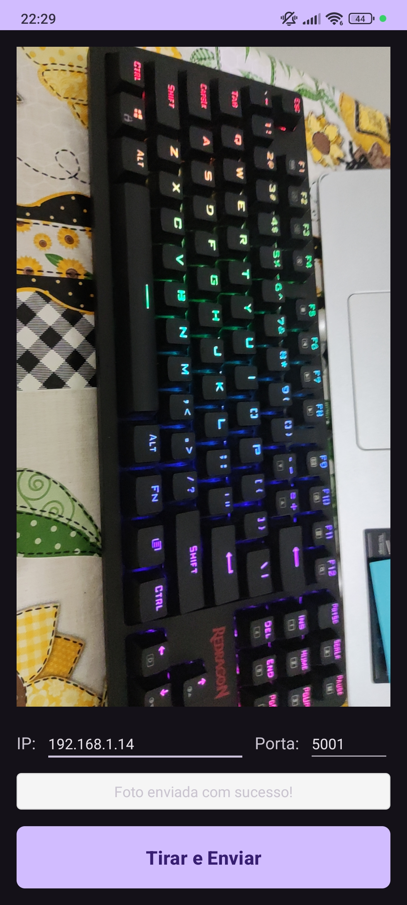
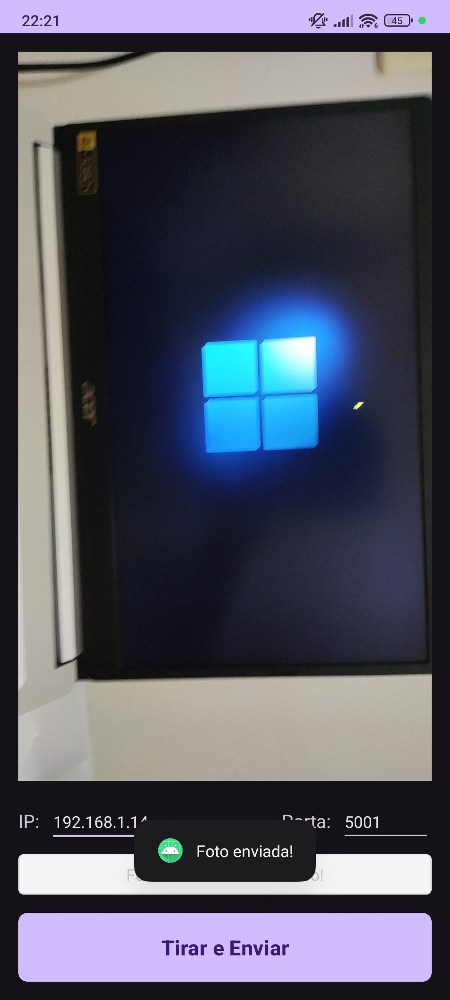
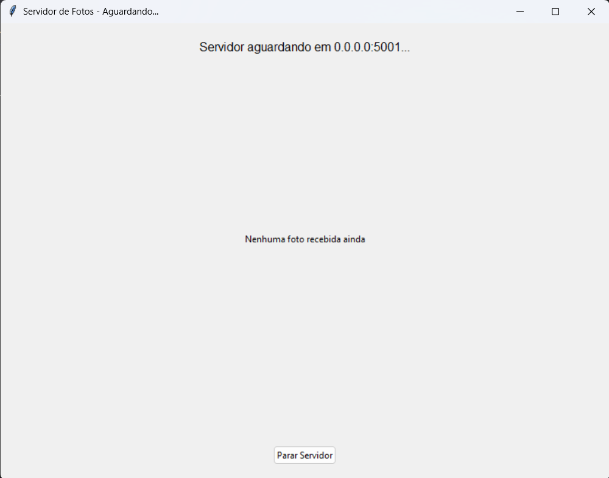
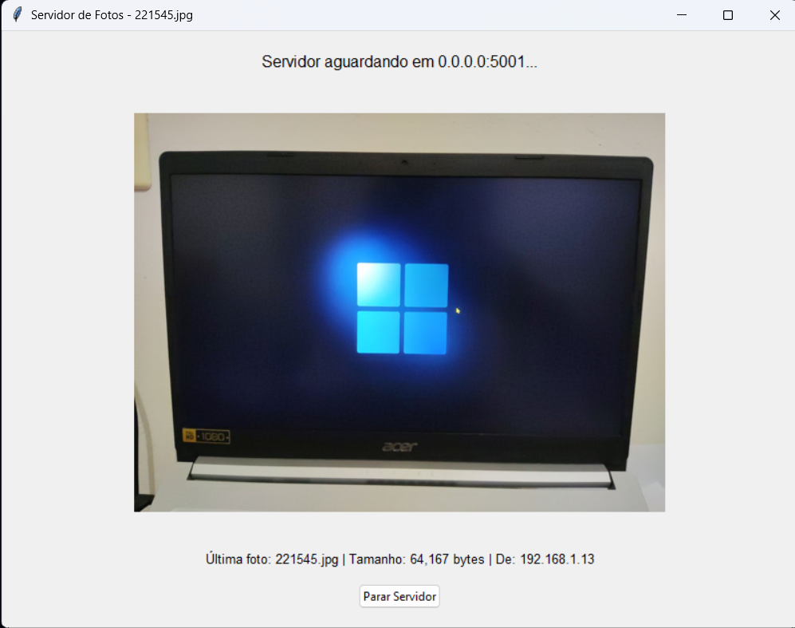

# 📸 Android Sender - Android → Python via Socket TCP

Sistema completo para captura de fotos no Android e envio via socket TCP para servidor Python que salva e exibe as imagens.

## 🚀 Funcionalidades

- **App Android**: Captura fotos com CameraX e envia via socket TCP
- **Servidor Python**: Recebe, salva e exibe fotos em tempo real
- **Interface gráfica**: Visualização imediata das fotos recebidas
- **Organização**: Fotos salvas por data (data/YYYY-MM-DD/)

## 📋 Requisitos

### Servidor Python
```bash
# Dependências necessárias
pip install Pillow
# tkinter já vem incluído no Python padrão
```

### App Android
- Android API 21+ (Android 5.0)
- Câmera física no dispositivo
- Permissões: CAMERA, INTERNET

## ⚙️ Configuração e Execução

### 1. Servidor Python

```bash
# 1. Salve o código do servidor como 'servidor.py'
# 2. Execute o servidor
python servidor.py
```

O servidor iniciará em `0.0.0.0:5001` e uma janela será aberta mostrando:
- Status da conexão
- Última foto recebida
- Informações da imagem (tamanho, origem)

### 2. App Android

```bash
# 1. Clona repositorio do github
# 2. No Android Studio, abrir o projeto na pasta client
# 3. Executar no dispositivo físico (emulador pode não ter câmera)
```

**Importante**: Altere o IP padrão no `MainActivity.kt` linha 36:
```kotlin
binding.editTextServerIp.setText("SEU_IP_AQUI") // Ex: "192.168.1.100"
```

## 🌐 Configuração de Rede

### Descobrir o IP do seu computador:

**Windows:**
```cmd
ipconfig
```

**Linux/Mac:**
```bash
ifconfig
# ou
ip addr show
```

### Configurações de Firewall
Certifique-se de que a porta 5001 está liberada no firewall do computador.

**Windows:**
```cmd
# Permitir porta 5001 no Windows Firewall
netsh advfirewall firewall add rule name="PhotoServer" dir=in action=allow protocol=TCP localport=5001
```

## 📡 Protocolo de Comunicação

### Formato dos dados enviados:
1. **Tamanho da imagem** (4 bytes): Inteiro big-endian indicando o tamanho da imagem em bytes
2. **Dados da imagem** (N bytes): Dados binários da imagem em formato JPEG
3. **Confirmação** (2 bytes): Servidor responde "OK" após salvar

### Processamento da imagem:
- **Formato**: JPEG
- **Qualidade**: 80%
- **Redimensionamento**: Máximo 1280px de largura (mantém proporção)
- **Otimização**: Reduz tamanho para transmissão mais rápida

## 📁 Estrutura de Arquivos

### Servidor Python:
```
projeto/
├── servidor.py
└── data/
    └── YYYY-MM-DD/          # Pasta criada automaticamente
        ├── HHMMSS.jpg       # Fotos salvas com timestamp
        └── ...
```

## 🖼️ Screenshots e Demonstração

### Servidor Python:
- **Tela inicial**: "Aguardando fotos..."
- **Após receber foto**: Exibe a imagem redimensionada
- **Informações**: Nome do arquivo, tamanho, IP do remetente

### App Android:
- **Preview da câmera**: Visualização em tempo real
- **Configuração**: Campos para IP e porta do servidor
- **Status**: Indicador do progresso (capturando → enviando → sucesso)
- **Botão principal**: "Tirar e Enviar"

### App Android
| Interface do App | Foto Enviada |
|:----------------:|:------------:|
|  |  |

### Servidor Python
**Servidor Aguardando**  


**Foto Recebida**  


## 🔧 Solução de Problemas

### Problemas comuns:

**1. Erro de conexão no app:**
- Verifique se o IP está correto
- Confirme que o servidor está rodando
- Teste se ambos estão na mesma rede

**2. Servidor não recebe fotos:**
- Verifique firewall/antivírus
- Teste com outro dispositivo
- Confirme a porta 5001 está livre

**3. App não abre a câmera:**
- Verifique permissões no Android
- Teste em dispositivo físico (não emulador)

**4. Imagem não exibe no servidor:**
- Verifique se PIL está instalado: `pip install Pillow`
- Teste com uma imagem menor

## 📝 Notas Técnicas

### Segurança:
- Sistema usa HTTP não criptografado
- Adequado apenas para redes locais confiáveis

### Performance:
- Imagens são redimensionadas antes do envio
- Servidor processa um cliente por vez
- Tempo de envio depende da qualidade da rede
